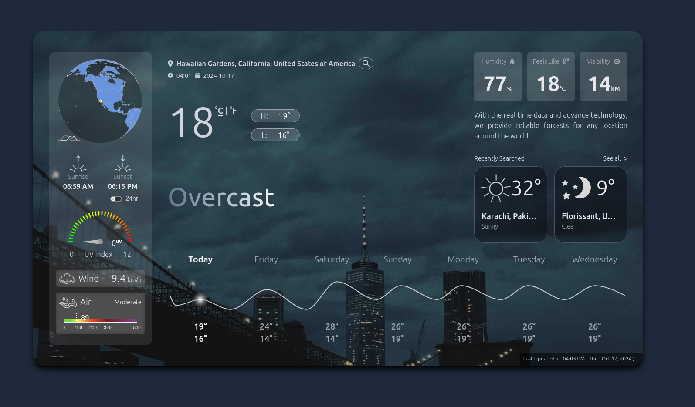
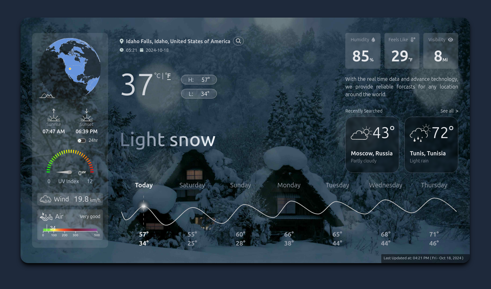
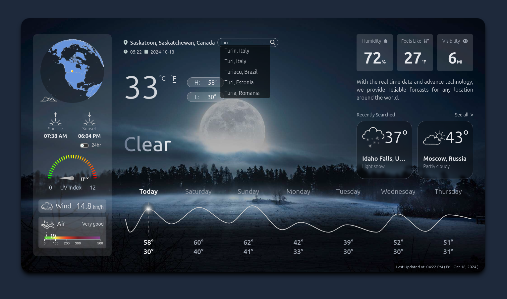

# Weather App

This is a **React-based Weather App** that provides real-time weather data for any location worldwide. It delivers accurate weather information such as temperature, humidity, wind speed, air quality, weekly forecast, and more.



## Features

- **Real-time Weather Data**: Get up-to-date weather information such as temperature, humidity, and wind speed for your current location or any location around the world.
- **Geolocation Support**: Automatically fetch weather data based on the user’s current location.
- **Search by Location**: Search for weather updates from different cities worldwide.
- **Weather Details**:
  - Temperature (displayed in Celsius or Fahrenheit).
  - Humidity percentage.
  - Wind speed.
  - Air quality index.
  - Visibility distance (in kM or Miles).
  - Feels like temperature.
  - UV index.
- **Weather Forecast**: Displays daily weather forecasts for the upcoming week.
- **Air Quality Index**: Get information on the air quality in your area (Moderate, Unhealthy, etc.).
- **Sunrise & Sunset Times**: Shows the exact times for sunrise and sunset.
- **Weather Conditions**: Whether it's clear, cloudy, rainy, etc., displayed prominently.

## Technologies Used

- **React**: Front-end JavaScript library for building user interfaces.
- **WeatherApi.com API** for fetching real-time weather data.
- **CSS/TailwindCss** for styling the UI components.
- **Axios**: For making HTTP requests to fetch weather data.
- **React Hooks**: Efficient state management with `useState`, `useEffect`.


## Usage
- The app tries to get the location from public IP if there's no location previously saved.
- Enter the name of a city or town in the search box to get the current weather and forecast information.
- View essential weather details such as current temperature, humidity, wind speed, and a 7-day forecast.
- Monitor sunrise and sunset timings for the selected location.
- Access air quality information and UV index to stay informed about outdoor conditions.

## Screenshots

| Weather Overview | Location Search |
|------------------|-----------------|
|  |  |

## API Information

This app uses [WeatherAPI](https://weatherapi.com/) to retrieve real-time weather data.

## License

This project is licensed under the MIT License. See the [LICENSE](LICENSE) file for details. 

To ensure that anyone who clones your repository uses their own API key instead of the one you might be using for development, you can add a clear section in the `README.md` that explains how they should configure their own API provider. Here's an example of how you can word it:

---

## API Configuration (IMPORTANT)

This project requires an API for fetching weather data. **Please do not call the original API provider**. Follow the steps below to use your own API from a weather service provider (e.g., OpenWeather, WeatherStack, etc.).

### Steps to Set Up Your Own API Key:

1. **Sign up for an API provider**:
   - Visit a weather API provider's website (e.g., [OpenWeatherMap](https://openweathermap.org/), [WeatherAPI](https://www.weatherapi.com/)).
   - Create an account and generate an API key.

2. **Add Your API Key**:
   - Create a `.env` file in the root directory of the project (or as specified by the project setup).
   - In this `.env` file, store your API key like so:
     ```bash
     REACT_APP_API_KEY=your_api_key_here
     REACT_APP_BASE_URL=https://domain.com
     ```
   - **Do not commit** the `.env` file to version control to avoid exposing your API key.

3. **Use the API key in the application**:
   - Load the API key from environment variables like so:
     ```javascript
     const apiKey = process.env.REACT_APP_API_KEY;
     const baseUrl = process.env.REACT_APP_BASE_URL
     ```

4. **Important**:
   - **Do not call the original API provider with any API keys that you do not own**. Each user should use their own API key from their chosen provider.
   - API calls using the provided key in this repository will not work, and you must provide your own key.

### Example `.env` File

Here's an example of what your `.env` file should look like:

```
REACT_APP_API_KEY=your_personal_api_key
REACT_APP_BASE_URL=https://domain.com
```

Ensure that you include `.env` in your `.gitignore` file so that this sensitive information is never shared or exposed in the repository:

```
# .gitignore
.env
```
